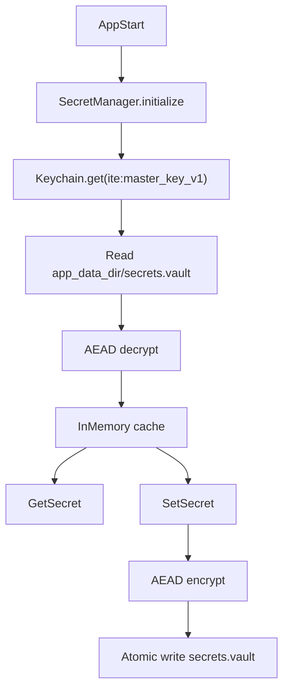

# 전략 B: Master Key + Encrypted Vault(Secret Manager) 구현 계획

## 목표

- macOS에서 로그인/앱 시작 시 **키체인 암호 입력을 1회로 고정**
- 시크릿(API 키, MCP/OAuth 토큰, Notion 토큰, 커넥터 토큰 등)을 **로컬 평문 저장 금지**
- 프로젝트 내보내기(`.ite` export)에 **시크릿이 절대 포함되지 않도록** 보장

## 현상(원인) 요약

현재는 시크릿이 여러 Keychain item으로 분산되어 있어, 앱 시작/상태 조회 시 Keychain을 여러 번 읽습니다.

- **Keychain 직접 접근 위치**:
  - [`src-tauri/src/mcp/oauth.rs`](src-tauri/src/mcp/oauth.rs): `mcp:oauth_token`, `mcp:client_id`
  - [`src-tauri/src/notion/client.rs`](src-tauri/src/notion/client.rs): `notion:integration_token`
  - [`src-tauri/src/mcp/notion_oauth.rs`](src-tauri/src/mcp/notion_oauth.rs): `mcp:notion_config`
  - [`src-tauri/src/commands/connector.rs`](src-tauri/src/commands/connector.rs): `connector:*`
  - [`src-tauri/src/commands/secure_store.rs`](src-tauri/src/commands/secure_store.rs): `ai:*`

또한 `.ite` export는 현재 DB 파일 자체를 내보냅니다:

- [`src-tauri/src/commands/storage.rs`](src-tauri/src/commands/storage.rs) 에서 `export_project_file()`은 **현재 DB를 그대로 `.ite`로 export**합니다.
- `src-tauri/src/lib.rs`에서 DB는 `app_data_dir/ite.db`로 생성/사용합니다.

따라서 **시크릿을 `ite.db`에 저장하면(암호화 여부와 무관하게)** `.ite` 파일에 포함되어 외부 공유/백업될 수 있어 보안상 금지입니다.

## 제안 아키텍처(전략 B)

### 핵심 아이디어

- **Keychain에는 마스터키 1개만 저장**: `ite:master_key_v1`
- 나머지 시크릿은 `app_data_dir/secrets.vault` 파일에 **AEAD로 암호화**하여 저장
- 앱 런타임에서는 SecretManager가:
  - 시작 시(또는 최초 필요 시) Keychain에서 마스터키를 1회 로드(프롬프트 1회)
  - `secrets.vault`를 복호화하여 메모리 캐시로 보관
  - 이후 모든 시크릿 읽기/쓰기는 **메모리 + 로컬 파일 업데이트**만 수행 (Keychain 추가 접근 없음)

### Vault 저장 방식(확정)

- **단일 파일 blob**: `app_data_dir/secrets.vault`
- DB(`ite.db`)에는 저장하지 않음(= `.ite` export 포함 방지)

## 암호화/키 관리 설계

### 마스터키

- 길이: 32 bytes(256-bit)
- 생성: `rand`로 CSPRNG 사용
- 저장: Keychain item 1개(`service = com.ite.app`, `key = ite:master_key_v1`)
- 표현: base64 문자열(저장/디버깅 편의)
- 런타임: 메모리에 캐시하되, 가능한 경우 `zeroize`로 drop 시 메모리 지우기

### 암호화 알고리즘

- 권장: **XChaCha20-Poly1305 (AEAD)**
- 이유: nonce(24 bytes) 관리가 상대적으로 안전하고 Rust 생태계에서 사용성이 좋음

### 파일 포맷(v1, 제안)

- `magic`: `ITESECR1` (8 bytes)
- `nonce`: 24 bytes
- `ciphertext`: AEAD 결과(= 암호문 + 태그)
- `aad`: `magic`를 AAD로 사용(포맷 바인딩)
- `plaintext`: `serde_json`로 직렬화한 `SecretsPayload`

> 포맷은 반드시 **버저닝**합니다(향후 알고리즘/필드 변경 대비).

## 데이터 모델(SecretsPayload)

- 키는 **namespaced string**으로 통일하여, 기존 분산 키체인 키들을 흡수합니다.

예시 키:

- `ai/openai_api_key`
- `ai/brave_api_key`
- `mcp/atlassian/oauth_token_json`
- `mcp/atlassian/client_json`
- `notion/integration_token`
- `mcp/notion/config_json`
- `connector/<connector_id>/token_json`

저장 값은 문자열(대부분 JSON)로 유지하여 기존 코드 변경 범위를 최소화합니다.

## Rust 모듈 구성(신규)

- [`src-tauri/src/secrets/mod.rs`](src-tauri/src/secrets/mod.rs)
  - public API re-export
- [`src-tauri/src/secrets/vault.rs`](src-tauri/src/secrets/vault.rs)
  - 파일 I/O, 포맷 파싱/생성, atomic write
- [`src-tauri/src/secrets/manager.rs`](src-tauri/src/secrets/manager.rs)
  - master key 로드/생성
  - vault decrypt/encrypt
  - in-memory cache(RwLock)
  - get/set/delete
  - 마이그레이션 엔트리 포인트

## Tauri 명령(신규/변경)

### 신규(권장)

- `secrets_initialize()`
  - 앱 시작 시 1회 호출(또는 Rust setup에서 lazy init)
  - master key 1회 로드
  - vault 복호화 후 캐시에 적재
- `secrets_get(keys: Vec<String>) -> HashMap<String, String>`
- `secrets_set(entries: Vec<{key,value}>)`
- `secrets_delete(keys: Vec<String>)`

### 기존 API 호환(변경)

- [`src-tauri/src/commands/secure_store.rs`](src-tauri/src/commands/secure_store.rs)
  - `set_secure_secret/get_secure_secret/delete_secure_secret`는 **더 이상 Keychain에 직접 저장하지 않고** SecretManager를 통해 vault에 저장
  - 프론트의 `src/tauri/secureStore.ts` 변경 최소화

## 기존 모듈 리팩터링(키체인 직접 접근 제거)

- [`src-tauri/src/mcp/oauth.rs`](src-tauri/src/mcp/oauth.rs)
  - `load_from_keychain/save_to_keychain/delete_from_keychain` 제거/대체
  - SecretManager에서 `mcp/atlassian/*`를 읽고/저장하도록 수정
- [`src-tauri/src/notion/client.rs`](src-tauri/src/notion/client.rs)
  - Notion integration token을 SecretManager에서 읽기/저장
- [`src-tauri/src/mcp/notion_oauth.rs`](src-tauri/src/mcp/notion_oauth.rs)
  - Notion MCP config를 SecretManager에서 읽기/저장
- [`src-tauri/src/commands/connector.rs`](src-tauri/src/commands/connector.rs)
  - `connector_*` 명령이 connector 토큰을 vault에서 읽기/저장
  - `connector_list_status`는 keychain N회 조회 대신 vault 캐시에서 O(N) 확인(프롬프트 없음)

## 마이그레이션(기존 Keychain → Vault) 정책(확정)

- 마이그레이션 성공 시 **기존 Keychain 엔트리 삭제**
- 단, 중요한 UX 포인트:
  - Keychain은 item 단위로 권한 프롬프트가 뜰 수 있어, **마이그레이션 과정에서 1회성 다중 프롬프트가 발생**할 수 있습니다.
  - 이를 피하려면 "자동 마이그레이션" 대신 **Settings에서 사용자가 명시적으로 실행**하는 버튼(예: "기존 로그인 정보 가져오기")으로 제공하는 것이 Non-Intrusive UX에 더 적합합니다.

권장 UX:

- 앱 업데이트 후에는 새 SecretManager만 준비
- Settings → Security 섹션에:
  - "기존 Keychain 로그인 정보 가져오기(1회)" 버튼
  - 사용자가 클릭하면: 알려진 키들을 순차적으로 읽어 vault에 저장 후 삭제

## 앱 시작(초기화) 흐름

- Rust에서:
  - [`src-tauri/src/lib.rs`](src-tauri/src/lib.rs) setup 단계에서 SecretManager를 초기화(또는 lazy)
  - MCP 자동연결 등 초기 로직이 시크릿을 읽을 때는 **반드시 SecretManager를 통해** 접근
- Frontend에서:
  - `src/App.tsx`의 `loadSecureKeys()`는 유지 가능(내부적으로 vault를 읽게 됨)
  - `mcpClientManager.initialize()`에서 Rust가 keychain을 읽지 않도록 수정되면, **앱 시작 시 프롬프트는 master key 1회만** 발생

## 문서/스펙(Docs-first) 변경

- [`trd.md`](trd.md)
  - 7.2(API Key 관리): 현행 번들(`ai:api_keys_bundle`) 설명을 **SecretManager/Vault 모델로 교체**
  - 7.3(External Connectors/MCP): "토큰 저장 위치=OS 키체인" 문구를
    - "Keychain에는 master key만"
    - "토큰은 app_data_dir vault에 암호화 저장"
    로 변경
  - `.ite export`에 시크릿이 포함되지 않도록 설계 원칙을 명시

## 검증 체크리스트(완료 기준)

- macOS에서 앱 시작 시 키체인 프롬프트가 **최대 1회**만 뜬다.
- MCP/Notion/Connector 상태 조회가 프롬프트를 유발하지 않는다.
- `.ite` export 파일에 시크릿이 포함되지 않는다(파일 내용/DB 테이블 확인).

