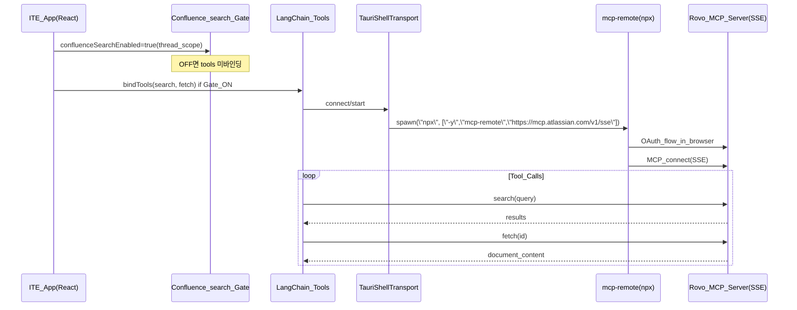

# Rovo MCP Integration Specifications (Confluence: `search()` / `fetch()`)

## 1. Overview
이 문서는 ITE에서 **Atlassian Rovo MCP Server**를 통해 Confluence 문서를 **검색(`search`)**하고 **가져오기(`fetch`)** 위한 MCP 연동 스펙을 정의합니다.

핵심 원칙:
- **OAuth 2.1 전제**: 사용자가 API Token/API Key를 입력해 MCP 서버를 직접 두드리는 구조는 지원/권장되지 않습니다.
- **게이트(Non-Intrusive)**: Chat 탭에서 `Confluence_search` 토글이 켜져 있을 때만 Rovo MCP 도구를 모델에 바인딩/노출합니다.
- **Lazy OAuth**: 토글 ON이 즉시 브라우저 인증을 강제하지 않습니다. 실제로 `search/fetch`가 필요할 때 연결이 없으면 “Connect” CTA를 통해 사용자 클릭으로 OAuth를 시작합니다.

참고(공식 가이드): [Setting up IDEs (desktop clients)](https://support.atlassian.com/atlassian-rovo-mcp-server/docs/setting-up-ides/)

## 2. Architecture (MVP: `mcp-remote` Proxy)
MVP 단계에서는 공식 가이드 흐름에 맞춰 **`mcp-remote`를 프록시로 사용**합니다.

## 3. Endpoint
- **SSE URL**: `https://mcp.atlassian.com/v1/sse`

## 4. Prerequisites (MVP)
- **Node.js 18+**: `npx`로 `mcp-remote` 실행
- **브라우저**: OAuth 동의 플로우 진행
- **Atlassian Cloud + Confluence 권한**: 사용자의 기존 권한 범위 내에서만 접근 가능

## 5. Connection & Auth Policy

### 5.1 OAuth 2.1 Only
- Rovo MCP 연동은 OAuth 2.1 기반을 전제합니다.
- 따라서 App Settings에 “Atlassian API Token/Email/Site URL”을 입력받는 방식은 **제거 대상(계획)**입니다.

### 5.2 Lazy OAuth UX
- `Confluence_search` 토글 ON: “도구 사용 허용” 상태만 의미
- 실제 `search/fetch` 호출이 필요할 때 연결이 없으면:
  - UI에서 “Atlassian 연결(Connect)” CTA를 노출
  - **사용자 클릭으로만** 브라우저 OAuth 시작

## 6. Tool Contract (ITE-side)
> 주의: Rovo MCP의 세부 스키마는 서버 구현/버전에 따라 달라질 수 있으므로, ITE는 **반환값을 보수적으로 처리**해야 합니다.

### 6.1 `search()`
- 목적: Confluence 문서 후보를 찾는다.
- ITE 처리(권장):
  - 상위 N개만 사용
  - 결과에서 가능한 식별자(id/url/key 등)를 추출

### 6.2 `fetch()`
- 목적: 특정 문서의 본문/메타를 가져온다.
- ITE 처리(권장):
  - 본문은 텍스트로 정규화(HTML/마크업 최소화)
  - 길이 제한(예: 최대 X자) + 필요 시 요약

### 6.3 Safety / Limits (권장)
- 한 요청에서 가져오는 문서 수/길이 제한
- 토큰 폭주 방지를 위해 `search` 후 `fetch`는 최소 호출로 유지
- Tool 사용 표시는 “도구 사용됨/실행 중” 배지로 가시화(Non-Intrusive)

## 7. UI / UX Requirements

### 7.1 `Confluence_search` Toggle
- 위치: Chat composer 하단 `+` 메뉴(웹검색 체크와 동일 패턴)
- 스코프: **채팅 탭(thread) 단위**
- 게이트 규칙:
  - OFF: `search/fetch`를 모델에 바인딩/노출하지 않음
  - ON: `search/fetch`를 바인딩 가능(단, 연결은 Lazy)

### 7.2 App Settings 정리(계획)
- “Atlassian MCP” 토큰 입력형 설정 UI는 제거
- Confluence 검색은 채팅 흐름 내 게이트/연결 CTA로 제어

## 8. Roadmap

### MVP (Proxy 기반)
- `npx -y mcp-remote https://mcp.atlassian.com/v1/sse`
- Node.js 필요

### Production (Proxy 제거, 권장 방향)
- 앱이 OAuth 2.1을 직접 처리(리다이렉트/콜백/토큰 저장)
- 앱이 `https://mcp.atlassian.com/v1/sse`로 직접 MCP 연결

## 9. Troubleshooting

| 증상 | 원인 | 해결 |
|------|------|------|
| `npx` 실행 실패 | Node.js 미설치/버전 낮음 | Node.js 18+ 설치 |
| OAuth 화면이 반복/실패 | 만료/권한/로그인 문제 | 재로그인 후 재시도 |
| 연결이 자주 끊김 | 토큰 만료/네트워크 | Connect CTA로 재인증 |
