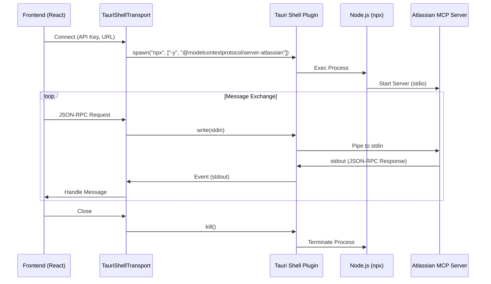

# MCP Integration Specifications

## 1. Overview
This document outlines the technical specifications for integrating the **Model Context Protocol (MCP)** into the Translation Editor. The initial implementation (MVP) focuses on the **Atlassian MCP server** using a Tauri Shell bridge.

### Architecture (MVP)



## 2. Prerequisites
- **Node.js & npm**: Must be installed on the user's machine (for MVP).
- **Atlassian Account**: API Token, Email, and Instance URL required.

## 3. Configuration

### 3.1 Tauri Capabilities
To allow the frontend to spawn the `npx` process, update `src-tauri/capabilities/default.json`.

```json
{
  "permissions": [
    "shell:allow-spawn",
    {
      "identifier": "shell:allow-spawn",
      "allow": [
        {
          "name": "npx",
          "args": ["-y", "@modelcontextprotocol/server-atlassian"],
          "sidecar": false
        }
      ]
    }
  ]
}
```
*Note: The actual permission identifier might be `shell:spawn` depending on the plugin version.*

### 3.2 Environment Variables (Injected)
The Atlassian MCP server requires the following environment variables. Since we spawn the process from Tauri, we must pass these `env` vars during the spawn call.

- `ATLASSIAN_API_TOKEN`
- `ATLASSIAN_EMAIL`
- `ATLASSIAN_INSTANCE_URL`

## 4. Implementation Specs

### 4.1 `TauriShellTransport.ts`
Custom implementation of the `Transport` interface from `@modelcontextprotocol/sdk`.

- **Interface**:
  ```typescript
  import { Transport } from "@modelcontextprotocol/sdk/shared/transport.js";
  
  export class TauriShellTransport implements Transport {
    constructor(private command: string, private args: string[], private env: Record<string, string>) {}
    
    async start(): Promise<void> {
      // 1. Command.spawn(this.command, this.args, { env: this.env })
      // 2. Listen to 'close', 'error', 'stdout' events
      // 3. Buffer stdout and parse JSON-RPC messages
    }
    
    async send(message: JSONRPCMessage): Promise<void> {
      // child.write(JSON.stringify(message) + "\n")
    }
    
    async close(): Promise<void> {
      // child.kill()
    }
  }
  ```

### 4.2 `McpClientManager.ts`
Manages the lifecycle of the MCP Client.

- **Dependencies**: `@modelcontextprotocol/sdk`, `@langchain/mcp-adapters`
- **Functions**:
  - `connectAtlassian(config: AtlassianConfig)`: Initializes `Client` with `TauriShellTransport`.
  - `getTools()`: Uses `loadMcpTools` (from adapters) or manual tool conversion to return LangChain-compatible tools.
  - `disconnect()`: Cleans up resources.

### 4.3 UI Components (`AppSettingsModal.tsx`)
New section "Integrations" > "Atlassian MCP".

- **Fields**:
  - `Instance URL` (e.g., `https://my-team.atlassian.net`)
  - `Email` (e.g., `user@example.com`)
  - `API Token` (Password input)
- **Actions**:
  - `Connect`: Validates input -> Calls `McpClientManager.connectAtlassian` -> Updates status.
  - `Disconnect`: Calls `disconnect`.
- **Status**:
  - 🔴 Disconnected
  - 🟡 Connecting...
  - 🟢 Connected

## 5. Roadmap

### Phase 6 (MVP)
- [ ] Install dependencies (`@modelcontextprotocol/sdk`, `@langchain/mcp-adapters`)
- [ ] Configure Tauri Shell permissions
- [ ] Implement `TauriShellTransport`
- [ ] Implement `McpClientManager`
- [ ] Add UI to `AppSettingsModal`

### Phase 7 (Production)
- [ ] **Sidecar Migration**: Replace `npx` with a packaged binary.
  - Create `atlassian-mcp` binary using `pkg`.
  - Register as Tauri sidecar.
  - Update Transport to use `Command.sidecar` instead of `Command.spawn`.
- [ ] **Multi-Server Support**: Support Google Drive, Slack, etc.
- [ ] **Persistent Config**: Save connected integrations in SQLite/Store.

