# MCP Integration Specifications

## 1. Overview
This document outlines the technical specifications for integrating the **Model Context Protocol (MCP)** into the Translation Editor. The initial implementation (MVP) focuses on the **Atlassian MCP server** using a Tauri Shell bridge.

### Architecture (MVP)

```mermaid
sequenceDiagram
    participant React as Frontend (React)
    participant Bridge as TauriShellTransport
    participant Tauri as Tauri Shell Plugin
    participant Node as Node.js (npx)
    participant MCP as Atlassian MCP Server

    React->>Bridge: Connect (API Key, URL)
    Bridge->>Tauri: spawn("npx", ["-y", "atlassian-mcp"])
    Tauri->>Node: Exec Process
    Node->>MCP: Start Server (stdio)
    
    loop Message Exchange
        React->>Bridge: JSON-RPC Request
        Bridge->>Tauri: write(stdin)
        Tauri->>MCP: Pipe to stdin
        MCP->>Tauri: stdout (JSON-RPC Response)
        Tauri->>Bridge: Event (stdout)
        Bridge->>React: Handle Message
    end

    React->>Bridge: Close
    Bridge->>Tauri: kill()
    Tauri->>Node: Terminate Process
```



## 2. Prerequisites
- **Node.js & npm**: Must be installed on the user's machine (for MVP).
- **Atlassian Account**: API Token, Email, and Instance URL required.

## 3. Configuration

### 3.1 Tauri Capabilities (Tauri 2.x)
To allow the frontend to spawn the `npx` process, update `src-tauri/capabilities/default.json`.

> ⚠️ **Important (Tauri 2.x)**: 
> - Use `cmd` field instead of `command` in scope configuration
> - Include `shell:allow-stdin-write` and `shell:allow-kill` for full MCP communication

```json
{
  "$schema": "../gen/schemas/desktop-schema.json",
  "identifier": "main-capability",
  "description": "main window IPC permissions",
  "windows": ["main"],
  "permissions": [
    "core:default",
    "shell:allow-spawn",
    "shell:allow-execute",
    "shell:allow-stdin-write",
    "shell:allow-kill",
    {
      "identifier": "shell:allow-spawn",
      "allow": [
        {
          "name": "npx",
          "cmd": "npx",
          "args": true,
          "sidecar": false
        },
        {
          "name": "node",
          "cmd": "node",
          "args": true,
          "sidecar": false
        }
      ]
    },
    {
      "identifier": "shell:allow-execute",
      "allow": [
        {
          "name": "npx",
          "cmd": "npx",
          "args": true,
          "sidecar": false
        },
        {
          "name": "node",
          "cmd": "node",
          "args": true,
          "sidecar": false
        }
      ]
    }
  ]
}
```

### 3.2 Environment Variables (Injected)
The Atlassian MCP server requires the following environment variables. Since we spawn the process from Tauri, we must pass these `env` vars during the spawn call.

- `ATLASSIAN_API_TOKEN`
- `ATLASSIAN_EMAIL`
- `ATLASSIAN_INSTANCE_URL`

### 3.3 NPM Package (Updated 2024-12)

> ⚠️ **Note**: `@modelcontextprotocol/server-atlassian` does **NOT exist** on npm.

**Available Atlassian MCP packages:**
| Package | Description |
|---------|-------------|
| `atlassian-mcp` | MCP server for Atlassian Confluence and Jira integration (recommended) |
| `@xuandev/atlassian-mcp` | MCP server for Atlassian Confluence and Jira Cloud APIs |
| `@ecubelabs/atlassian-mcp` | Alternative implementation |

**Current implementation uses**: `atlassian-mcp`

## 4. Implementation Specs

### 4.1 `TauriShellTransport.ts`
Custom implementation of the `Transport` interface from `@modelcontextprotocol/sdk`.

> ⚠️ **Tauri 2.x API Note**: 
> - Use `Command.create(program, args, options)` with `SpawnOptions` as third argument
> - `.env()` method chaining is **NOT supported** (documentation is incorrect)
> - Environment variables must be passed via `SpawnOptions.env`

- **Interface**:
  ```typescript
  import { Transport } from "@modelcontextprotocol/sdk/shared/transport.js";
  import { Command, Child } from "@tauri-apps/plugin-shell";
  
  export class TauriShellTransport implements Transport {
    constructor(
      private command: string, 
      private args: string[], 
      private env: Record<string, string>
    ) {}
    
    async start(): Promise<void> {
      // Tauri 2.x: SpawnOptions as third argument (NOT method chaining)
      const options: { env?: Record<string, string> } = {};
      if (Object.keys(this.env).length > 0) {
        options.env = this.env;
      }
      
      const cmd = Command.create(this.command, this.args, options);
      
      // Event listeners
      cmd.stdout.on('data', (line: string) => this.handleData(line));
      cmd.stderr.on('data', (line: string) => console.warn('[MCP Stderr]', line));
      cmd.on('close', (data) => { /* handle close */ });
      cmd.on('error', (error) => { /* handle error */ });
      
      this.child = await cmd.spawn();
    }
    
    async send(message: JSONRPCMessage): Promise<void> {
      await this.child.write(JSON.stringify(message) + "\n");
    }
    
    async close(): Promise<void> {
      await this.child.kill();
    }
  }
  ```

### 4.2 `McpClientManager.ts`
Manages the lifecycle of the MCP Client.

- **Dependencies**: `@modelcontextprotocol/sdk`, `@langchain/mcp-adapters`
- **NPM Package**: `atlassian-mcp` (via npx)
- **Functions**:
  - `connectAtlassian(config: AtlassianConfig)`: Initializes `Client` with `TauriShellTransport`.
  - `getTools()`: Uses `loadMcpTools` (from adapters) or manual tool conversion to return LangChain-compatible tools.
  - `disconnect()`: Cleans up resources.

- **Usage**:
  ```typescript
  this.transport = new TauriShellTransport(
    "npx", 
    ["-y", "atlassian-mcp"],  // ✅ Correct package name
    {
      ATLASSIAN_EMAIL: config.email,
      ATLASSIAN_API_TOKEN: config.apiToken,
      ATLASSIAN_INSTANCE_URL: config.instanceUrl
    }
  );
  ```

### 4.3 UI Components (`AppSettingsModal.tsx`)
New section "Integrations" > "Atlassian MCP".

- **Fields**:
  - `Instance URL` (e.g., `https://my-team.atlassian.net`)
  - `Email` (e.g., `user@example.com`)
  - `API Token` (Password input)
- **Actions**:
  - `Connect`: Validates input -> Calls `McpClientManager.connectAtlassian` -> Updates status.
  - `Disconnect`: Calls `disconnect`.
- **Status**:
  - 🔴 Disconnected
  - 🟡 Connecting...
  - 🟢 Connected

## 5. Roadmap

### Phase 6 (MVP) ✅ Completed
- [x] Install dependencies (`@modelcontextprotocol/sdk`, `@langchain/mcp-adapters`)
- [x] Configure Tauri Shell permissions (with `cmd` field for Tauri 2.x)
- [x] Implement `TauriShellTransport` (SpawnOptions pattern)
- [x] Implement `McpClientManager`
- [x] Add UI to `AppSettingsModal`
- [x] Fix npm package name (`atlassian-mcp` instead of non-existent `@modelcontextprotocol/server-atlassian`)

### Phase 7 (Production)
- [ ] **Sidecar Migration**: Replace `npx` with a packaged binary.
  - Create `atlassian-mcp` binary using `pkg`.
  - Register as Tauri sidecar.
  - Update Transport to use `Command.sidecar` instead of `Command.spawn`.
- [ ] **Multi-Server Support**: Support Google Drive, Slack, etc.
- [ ] **Persistent Config**: Save connected integrations in SQLite/Store.

## 6. Troubleshooting

### Common Errors

| Error | Cause | Solution |
|-------|-------|----------|
| `error deserializing scope: The shell scope 'command' value is required` | Tauri 2.x requires `cmd` field | Use `"cmd": "npx"` instead of `"command": "npx"` in capabilities |
| `cmd.env is not a function` | Documentation incorrect for Tauri 2.x | Pass env via `Command.create(prog, args, { env })` third argument |
| `npm error 404 @modelcontextprotocol/server-atlassian` | Package doesn't exist | Use `atlassian-mcp` package instead |
| `MCP error -32000: Connection closed` | Process exits immediately | Check stderr logs for actual error (auth, PATH, etc.) |

