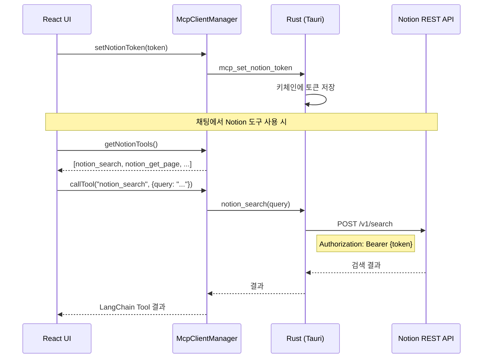

# Notion 연동 구현 계획

## 개요

Notion API를 직접 호출하는 Rust 네이티브 모듈과 LangChain 도구를 구현합니다.  
MCP 프로토콜 대신 **Notion REST API를 직접 사용**하여 로컬 서버 의존성을 제거합니다.

## ⚠️ 접근 방식 변경 이력

### 1차 시도: Notion 클라우드 MCP 서버
- `https://mcp.notion.com/mcp` 에 직접 연결 시도
- **결과**: 401 Unauthorized 버그 (Notion 측 문제)

### 2차 시도: 로컬 MCP 서버
- `npx @notionhq/notion-mcp-server --transport http` 실행
- **문제점**: 사용자가 별도로 Node.js 서버를 실행해야 함 (UX 불편)

### 최종 결정: Notion REST API 직접 호출
- MCP를 우회하고 Notion API를 직접 호출
- **장점**: 로컬 서버 불필요, Node.js 의존성 없음, Integration Token만 있으면 바로 사용

## 아키텍처



## 구현 범위

### Notion REST API 엔드포인트

| 도구 | API 엔드포인트 | 설명 |
|------|---------------|------|
| `notion_search` | `POST /v1/search` | 페이지/데이터베이스 검색 |
| `notion_get_page` | `GET /v1/pages/{id}` | 페이지 메타데이터 조회 |
| `notion_get_page_content` | `GET /v1/blocks/{id}/children` | 페이지 내용(블록) 조회 |
| `notion_query_database` | `POST /v1/databases/{id}/query` | 데이터베이스 쿼리 |

### 파일 구조

```
src-tauri/src/
├── notion/
│   ├── mod.rs              # 모듈 export
│   ├── client.rs           # Notion API 클라이언트
│   ├── types.rs            # API 응답 타입
│   └── tools.rs            # 도구별 함수 (search, get_page, ...)
├── commands/
│   └── notion.rs           # Tauri 명령어

src/
├── ai/
│   └── tools/
│       └── notionTools.ts  # LangChain 도구 정의
```

## 구현 완료 (2025-01-05)

### 구현된 파일

**Rust (백엔드)**:
- `src-tauri/src/notion/mod.rs` - 모듈 export
- `src-tauri/src/notion/client.rs` - Notion API 클라이언트
- `src-tauri/src/notion/types.rs` - API 응답 타입
- `src-tauri/src/commands/notion.rs` - Tauri 명령어

**TypeScript (프론트엔드)**:
- `src/ai/tools/notionTools.ts` - LangChain 도구
- `src/ai/mcp/McpClientManager.ts` - Notion 연결 관리 (수정)
- `src/components/settings/ConnectorsSection.tsx` - 설정 UI (수정)

**i18n**:
- `src/i18n/locales/ko.json`
- `src/i18n/locales/en.json`

## 구현 TODO

1. [x] **Notion 모듈 생성** (`src-tauri/src/notion/`)
   - mod.rs, client.rs, types.rs 생성
   - 키체인 토큰 관리

2. [x] **Notion API 클라이언트 구현**
   - search, get_page, get_blocks, query_database
   - 에러 처리

3. [x] **Tauri 명령어 추가**
   - notion_set_token, notion_has_token, notion_clear_token
   - notion_search, notion_get_page, notion_get_page_content, notion_query_database
   - lib.rs에 등록

4. [x] **LangChain 도구 정의**
   - notionTools.ts 생성
   - notion_search, notion_get_page, notion_query_database 구현

5. [x] **McpClientManager 수정**
   - MCP 기반 Notion 코드 제거
   - REST API 기반 도구로 대체

6. [x] **설정 UI 단순화**
   - Integration Token만 입력받도록 변경
   - 다이얼로그 단순화

7. [x] **i18n 업데이트**
   - 새로운 텍스트 번역

## Notion API 참고

- **Base URL**: `https://api.notion.com/v1`
- **인증**: `Authorization: Bearer {INTEGRATION_TOKEN}`
- **버전 헤더**: `Notion-Version: 2022-06-28`
- **문서**: https://developers.notion.com/reference

### 예시: 검색 API

```bash
curl -X POST 'https://api.notion.com/v1/search' \
  -H 'Authorization: Bearer ntn_xxx' \
  -H 'Notion-Version: 2022-06-28' \
  -H 'Content-Type: application/json' \
  -d '{"query": "검색어"}'
```

## 테스트 계획

1. **토큰 저장/로드**: 키체인에 토큰 저장 및 복원
2. **검색 테스트**: 페이지/데이터베이스 검색
3. **페이지 조회**: 페이지 메타데이터 및 내용 조회
4. **에러 처리**: 잘못된 토큰, 권한 없는 페이지 등
5. **채팅 통합**: AI가 Notion 도구를 올바르게 사용하는지 확인

## 주의사항

- Integration Token은 **만료되지 않음** (삭제되면 무효화)
- 페이지에 Integration을 **공유**해야 접근 가능
- API Rate Limit: 평균 3 req/sec
- 블록 조회 시 **페이지네이션** 필요 (100개씩)
